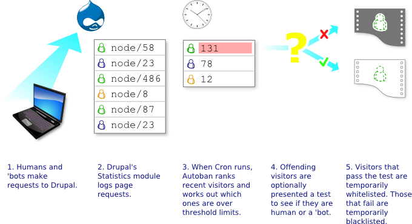

# How does Autoban work?

## Autoban Workflow

Optional challenges can be of the following types:

* User clicks a plain HTML link
* User clicks a Javascript link
* User downloads a plain 'beacon' image
* User downloads a beacon image after a Javascript call
* User has to answer a simple mathematical question
* User has to correctly enter a ReCaptcha

Challenges are presented as an HTTP 403 (Not Authorised) error page. In many cases this alone is sufficient to stop robots visiting the site, yet is invisible to humans using browsers. For most sites, a plain HTML link challenge is a sufficiently technical way to detect robots. However, if Spammers learn this and develop their robots to defeat this challenge then increasingly more sophisticated challenges are possible.

Users who successfully answer a challenge can be whitelisted for a period of time. This prevents Autoban considering them for challenging or blocking for that period of time.

Users who view the challenge repeatedly without answering, or who incorrectly answer the challenge a certain number of times are banned for a period of time. This prevents 'dumb' robots who ignore the HTTP 403 error code from continually consuming site resources. It also stops unsophisticated hacking attempts to defeat the challenge mechanism.
## Challenge Technology

Challenges are created when a visitor's IP address is determined to be over defined limits. This occurs during Cron runs. All challenges incorporate two pieces of unique information. One piece is unique to the site that Autoban is installed on. This is designed to stop 'blanket spamming' of the Autoban service.

The second part of the challenge is unique to the IP address, and is randomly generated when the challenge is issued. All challenges use both parts as a 'destination' for the challenge information. For the "link click" challenges, the user must only make an HTTP request to the Autoban service and provide the unique information. For beacon image challenges, the beacon image is served from the unique location. For the mathematical and ReCaptcha challenges, the result must be provided to the Autoban service along with the unique challenge information.

These two measures mean that spammers must obtain information from a site before they are able to attack it. That information changes over time, and is unique for each visitor (so different for each member of a 'bot network), and is unique to the site in question. This makes the job of automated spam traffic considerably more difficult than for a site without Autoban.
